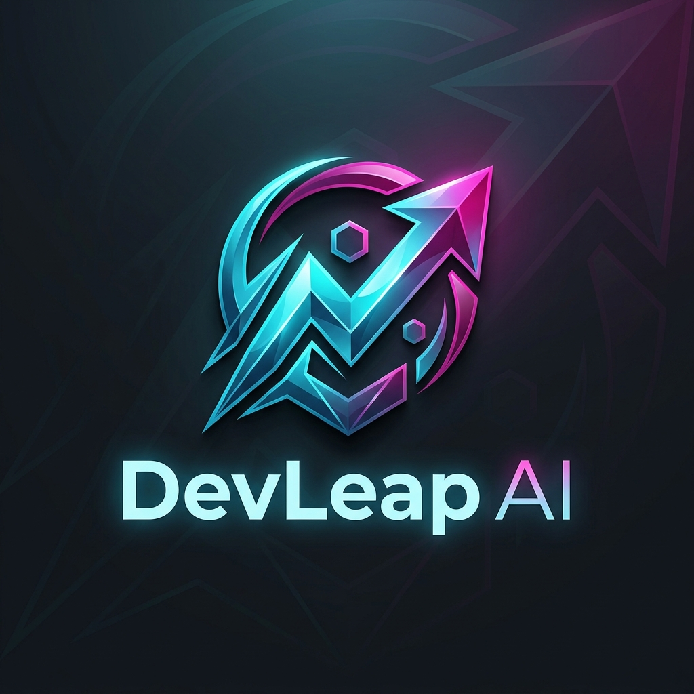

<div align="center">
  
  
  # DevLeap AI

  **The Future is Autonomous. Elevating Developer Outreach.**

  [](https://nextjs.org/)
  [](https://fastapi.tiangolo.com/)
  [](https://prisma.io/)
  [](https://tailwindcss.com/)
  [](https://ai.google.dev/)
</div>

---

## 🚀 Overview

**DevLeap AI** is an autonomous recruitment platform designed specifically for software engineers. It bridges the gap between your technical skills and market opportunities using cutting-edge AI.

By securely ingesting your GitHub repositories, DevLeap AI builds a highly accurate, technical "fingerprint" of your capabilities. It then uses the Google Gemini 2.5 Flash model—enhanced with native internet search grounding—to analyze job postings from the web, find overlapping skills, and automatically draft hyper-personalized cover letters and outreach pitches citing your exact code repos.

### ✨ Key Features

- **🧠 Deep Profiling (Ingestion Engine):** Connect your GitHub account and let DevLeap extract code architecture, technology stacks, and summary statistics to build your technical profile autonomously.
- **🎯 Market Matching (Broker Agent):** Paste a job URL (LinkedIn, Greenhouse, etc.), and the native Gemini Search Grounding agent will read the live job posting, bypassing expensive scraping APIs.
- **⚡ Autonomous Pitching:** Generates highly personalized, context-aware emails and cover letters that explicitly map the employer's requirements to specific projects you've built.
- **💳 Built-in Monetization:** Stripe integration for Pro-tier limits, premium AI token usage, and advanced broker features.
- **🔐 Secure Auth:** Enterprise-grade authentication powered by Clerk.

---

## 🛠 Tech Stack

### Frontend
- **Framework:** Next.js (App Router)
- **Styling:** Tailwind CSS + Custom CSS Variables
- **Animations:** GSAP (GreenSock) + Lenis (Smooth Scrolling)
- **3D Graphics:** Three.js + React Three Fiber (Hero Background)
- **Authentication:** Clerk
- **Payments:** Stripe Checkout

### Backend
- **Framework:** FastAPI (Python 3)
- **Database ORM:** Prisma Client Python
- **Database Engine:** PostgreSQL
- **AI/LLM:** Google GenAI SDK (Gemini 2.5 Flash)

---

## 📦 Project Structure

```text
DevLeap-AI/
├── frontend/                 # Next.js web application
│   ├── src/app/              # App Router pages & layouts
│   ├── src/components/       # Reusable UI & 3D elements
│   ├── src/lib/              # API clients & utilities
│   └── public/               # Static assets & logos
│
└── backend/                  # FastAPI python application
    ├── main.py               # Application entrypoint & REST API
    ├── prisma/               # Database schema & migrations
    ├── profiler/             # GitHub data extraction & AI profiling
    └── requirements.txt      # Python dependencies
```

---

## 🚦 Getting Started

### Prerequisites
- Node.js (v18+)
- Python (v3.10+)
- PostgreSQL instance (Local or Cloud)
- API Keys for Google Gemini, Clerk, and Stripe.

### 1. Database Setup
Ensure you have a PostgreSQL database running. Update your `backend/.env` with your `DATABASE_URL`.
```bash
cd backend
npx prisma db push
# or
npx prisma migrate dev
```

### 2. Backend Setup
Create a virtual environment, install dependencies, and run the FastAPI server.
```bash
cd backend
python -m venv venv
source venv/bin/activate  # Or `.\venv\Scripts\activate` on Windows
pip install -r requirements.txt

# Generate Prisma Client
prisma generate

# Run the development server
uvicorn main:app --reload --port 8000
```

### 3. Frontend Setup
Install dependencies and run the Next.js development server.
```bash
cd frontend
npm install

# Run the development server
npm run dev
```

The frontend will be available at `http://localhost:3000` and the backend API at `http://localhost:8000`.

---

## 🌍 Deployment

DevLeap AI is built to be easily deployed on modern cloud infrastructure.

1. **Database:** Deploy PostgreSQL on DigitalOcean Managed Databases, Supabase, or Render.
2. **Backend:** Deploy the FastAPI server to DigitalOcean App Platform, Heroku, or Azure App Service. 
3. **Frontend:** Deploy the Next.js app to Vercel or DigitalOcean App Platform.

> *For complete, step-by-step instructions on setting up production webhooks and environment variables, refer to the included deployment guides.*

---

<div align="center">
  Built with ❤️ by ZeonArc.
</div>
